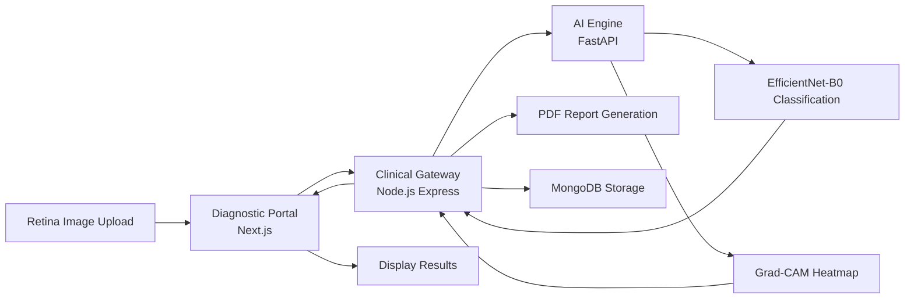

# 🩺 Healthway Diagnostics - Neural Retina Analysis

**Live Demo:** https://retina-25s2.vercel.app

Healthway Diagnostics is a professional-grade clinical platform that leverages deep learning to detect **Diabetic Retinopathy (DR)** from fundus photography (retina scans). Using an **EfficientNet-B0** neural engine, it provides instant diagnostic classification and visual Grad-CAM heatmaps to assist medical professionals.

---

## 📖 Table of Contents

* Architecture
* Key Features
* Application Screenshots
* System Workflow
* Project Structure
* Tech Stack
* Local Setup
* Deployment
* Contributing
* Disclaimer
* License

---

## 🏗️ Architecture

The system operates on a three-tier architecture:

### 1. AI Engine (Python/FastAPI)

High-performance inference server powered by PyTorch for retinal image analysis and Diabetic Retinopathy classification.

### 2. Clinical Gateway (Node.js/Express)

Middleware responsible for:

* Patient record management
* File uploads using Multer
* Communication with the AI service
* PDF report generation using PDFKit

### 3. Diagnostic Portal (Next.js/TypeScript)

Modern clinical dashboard providing:

* Retina image upload
* Real-time analysis status
* Diagnostic visualization
* Analysis history tracking

---

## ✨ Key Features

### 🧠 Neural Diagnosis

Classifies retinal scans into five stages:

* Healthy
* Mild DR
* Moderate DR
* Severe DR
* Proliferative DR

### 🔍 Explainable AI (XAI)

Generates Grad-CAM heatmaps highlighting retinal regions responsible for model predictions.

### 📄 Clinical Reports

Creates downloadable professional PDF diagnostic reports.

### 🗄️ History Management

Stores and retrieves previous patient analyses securely using MongoDB.

### 🖼️ Image Validation

Performs biological texture validation to prevent non-retinal image uploads.

---

## 📸 Application Screenshots

> Replace the placeholder images below with actual screenshots from the application.


## 🔄 System Workflow



---

## 📂 Project Structure

```text
Healthway-Diagnostics/
│
├── backend/                 # FastAPI + PyTorch AI Engine
│   ├── main.py
│   ├── requirements.txt
│   └── ...
│
├── server/                  # Node.js Middleware
│   ├── index.js
│   ├── package.json
│   └── ...
│
├── public/
├── src/
├── package.json
├── README.md
└── LICENSE
```


---

## 🛠️ Tech Stack

### Frontend

* Next.js 15
* React 19
* TypeScript
* Tailwind CSS
* SweetAlert2

### Middleware

* Node.js
* Express.js
* MongoDB (Mongoose)
* Multer
* PDFKit

### AI Backend

* Python 3.10+
* FastAPI
* PyTorch
* Torchvision
* OpenCV

---

## 🚀 Local Setup

### 1. Neural Engine (AI Service)

```bash
cd backend

python -m venv venv

source venv/bin/activate
# Windows
venv\Scripts\activate

pip install -r requirements.txt

python main.py
```

Runs on:

```text
http://127.0.0.1:8080
```

---

### 2. Clinical Gateway (Middleware)

```bash
cd server

npm install

# Create a .env file with:
# MONGO_URI=your_mongodb_uri
# AI_SERVICE_URL=http://127.0.0.1:8080

node index.js
```

Runs on:

```text
http://127.0.0.1:5000
```

---

### 3. Diagnostic Portal (Frontend)

```bash
npm install

# Create a .env.local file with:
# NEXT_PUBLIC_API_URL=http://127.0.0.1:5000

npm run dev
```

Runs on:

```text
http://127.0.0.1:3000
```

---

## 🌐 Deployment

This project is pre-configured for deployment on **Vercel** (Frontend) and **Render/Railway** (Backend & Middleware).

### Frontend

Deploy the root directory to Vercel and configure:

```env
NEXT_PUBLIC_API_URL=your_backend_url
```

### Middleware

Deploy the `/server` folder and configure:

```env
MONGO_URI=your_mongodb_uri
AI_SERVICE_URL=your_ai_service_url
```

### AI Service

Deploy the `/backend` folder.

Install dependencies using:

```bash
pip install -r requirements.txt
```

---

## 🤝 Contributing

Contributions are welcome and appreciated.

### How to Contribute

#### 1. Fork the Repository

Create your own copy of the repository.

#### 2. Create a New Branch

```bash
git checkout -b feature-name
```

#### 3. Make Changes

Implement your feature, bug fix, or documentation improvement.

#### 4. Commit Changes

```bash
git commit -m "Add feature"
```

#### 5. Push Changes

```bash
git push origin feature-name
```

#### 6. Open a Pull Request

Submit a PR with a clear description of your changes.

### Contribution Guidelines

* Follow the existing coding standards.
* Test changes before submitting.
* Keep pull requests focused and concise.
* Update documentation when necessary.
* Write meaningful commit messages.

---

## ⚠️ Disclaimer

**This software is intended for educational and research purposes only.**

It is **not a certified medical device** and should not be used as a replacement for professional medical diagnosis.

All diagnostic results generated by the neural engine must be reviewed and validated by a qualified ophthalmologist or healthcare professional.

---

## 📄 License

Distributed under the ISC License.

See the `LICENSE` file for more information.
